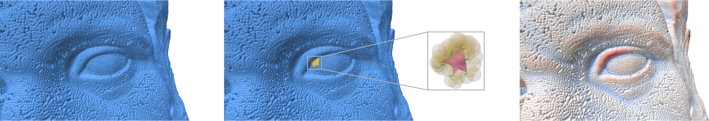
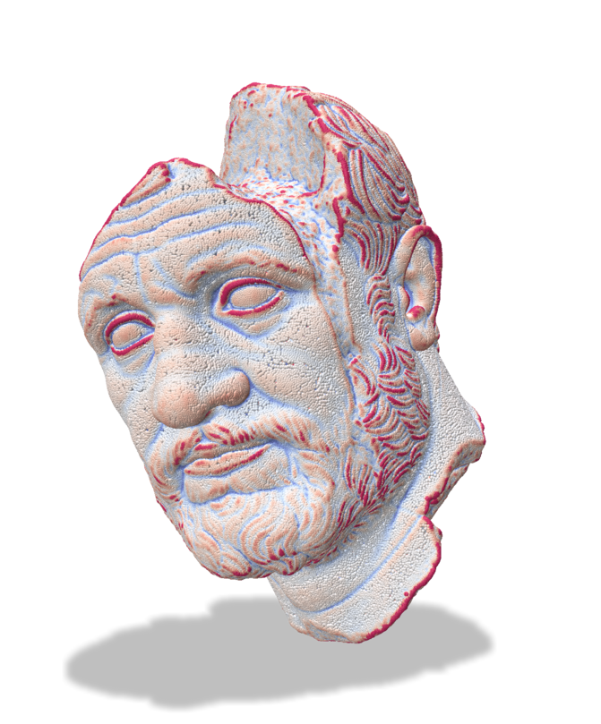
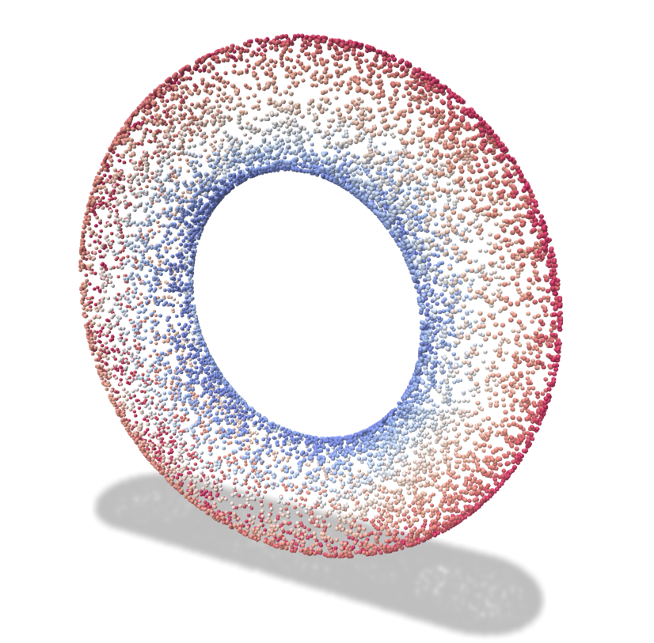
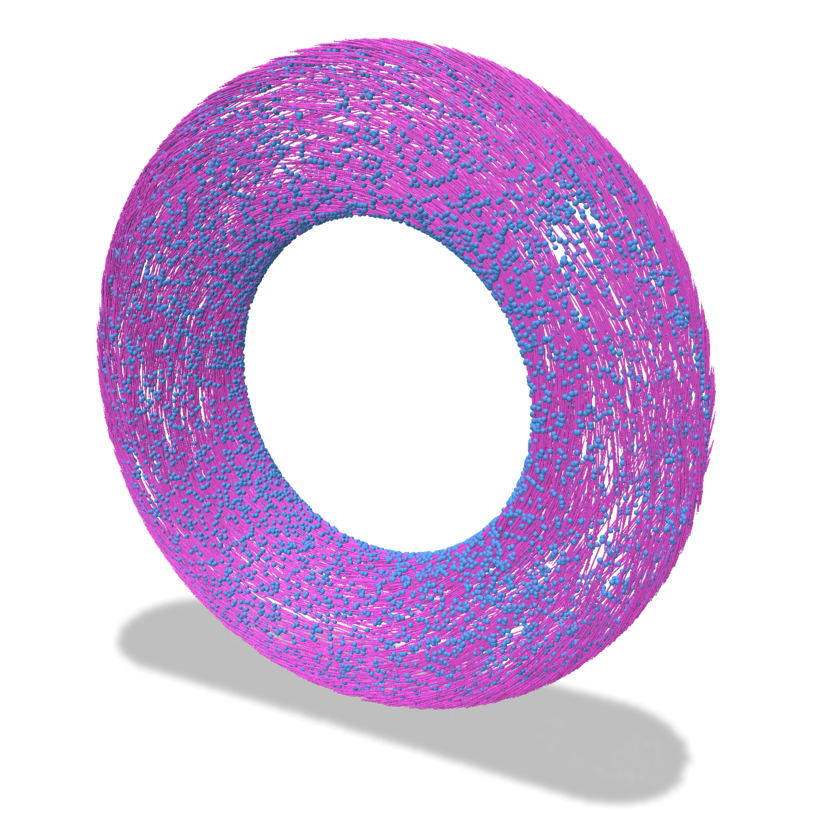
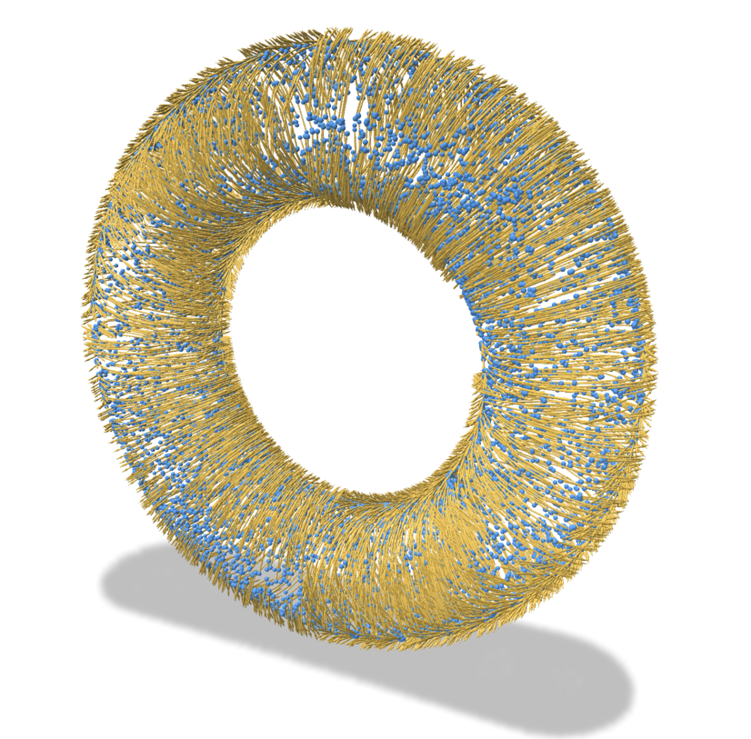

# Lightweight Curvature Estimation on Point Clouds with Randomized Corrected Curvature Measures


This repository provides an example application that implements the curvature estimators on oriented point clouds presented at [Symposium on Geometry Processing 2023, Genova, Italy, July 3-7](https://sgp2023.github.io):

Jacques-Olivier Lachaud, David Coeurjolly, Céline Labart, Pascal Romon, Boris Thibert, **Lightweight Curvature Estimation on Point Clouds with Randomized Corrected Curvature Measures**, *Comput. Graph. Forum*, 42(5), 2023. To appear.

## Building

Once cloned, proceed as follows on Linux/macos:

```
mkdir build
cd build
cmake .. -DCMAKE_BUILD_TYPE=Release
make -j 8
```

It will automatically fetch and install the dependencies [polyscope](https://polyscope.run) and [eigen](https://eigen.tuxfamily.org/).

## Usage

### Computing curvatures of point clouds approximating simple shapes

```
./curvatures
```

Run the program with a GUI that allows you to generate point clouds approximating simple shapes (sphere, torus, cube, dodecahedron).

### Computing curvatures of an oriented point cloud (given as text file)

```
./curvatures ../data/bearded-man-xyz-nxyz.pts
```

Text file should be composed of lines of the form `x y z nx ny nz` for each point, determining the coordinates (x,y,z) of each point and the components (nx,ny,nz) of its oriented normal vector.

### Computing curvatures of an oriented point cloud (given as a wavefront OBJ file)

```
./curvatures ../data/bunnyhead.obj
```

The OBJ file should contained the vertices as `v x y z` and normal vectors as `vn nx ny nz`.

### Using the interface

* Shape generation
  - `Sphere` generates a sphere of size `R` with `N` points
  - `Torus` generates a torus of great radius `R` and small radius `r` with `N` points
  - `Cube` generates a cube of size `R` with `N` points
  - `Dodecahedron` generates a dodecahedron of size `R` with `N` points
  - `InputFile` generates a set of points from the given input file
  - all shapes can be perturbated in position (parameter `x`) and in normals (parameter `xi`)
  - you may toggle between fast display (better when N > 5 millions) or nice display

* Curvature computation
  - `Curvatures` computes all curvature information (mean, Gaussian, principal curvatures and directions.
  - parameter `K` is the chosen number of nearest neighbors
  - parameter `T` is the chosen number of triangles (only for `Uniform` generation)
  - you may choose for triangle random generation methods among `Uniform`, `Independent`, `Hexagram`, `Avg-Hexagram` (see paper for details)
  - method `Avg-Hexagram` is the fastest, very accurate while staying robust to noise
  - parameter `W` balances between the normal to the points and the average normals of its neighbors to define the local sampling plane, 0.5 works well.

* Information
  - the total computation time of curvatures is displayed
  - l2 and loo errors are displayed for `Sphere` and `Torus` shape.
  
## Examples








